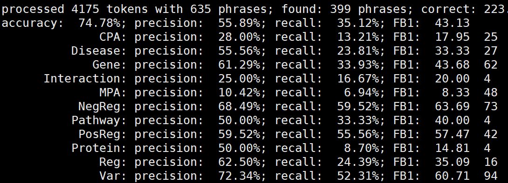

# BIONLP COURSE ASSIGNMENT

#### Discription
#### Task1 Trigger words NER
>Recognize the trigger words in PubMed abstracts and annotated them as correct trigger labels or entities (Var, MPA, Interaction, Pathway, CPA, Reg, PosReg, NegReg, Disease, Gene, Protein, Enzyme). 

#### Raw data
Each annotation is provided as a json file
<details>
<summary>example.json</summary>
{ "target": "http://pubannotation.org/docs/sourcedb/PubMed/sourceid/25805808", "sourcedb": "PubMed", "sourceid": "25805808", "text": "Loss-of-function de novo mutations play an important role in severe human neural tube defects.\nBACKGROUND: Neural tube defects (NTDs) are very common and severe birth defects that are caused by failure of neural tube closure and that have a complex aetiology. Anencephaly and spina bifida are severe NTDs that affect reproductive fitness and suggest a role for de novo mutations (DNMs) in their aetiology.\nMETHODS: We used whole-exome sequencing in 43 sporadic cases affected with myelomeningocele or anencephaly and their unaffected parents to identify DNMs in their exomes.\nRESULTS: We identified 42 coding DNMs in 25 cases, of which 6 were loss of function (LoF) showing a higher rate of LoF DNM in our cohort compared with control cohorts. Notably, we identified two protein-truncating DNMs in two independent cases in SHROOM3, previously associated with NTDs only in animal models. We have demonstrated a significant enrichment of LoF DNMs in this gene in NTDs compared with the gene specific DNM rate and to the DNM rate estimated from control cohorts. We also identified one nonsense DNM in PAX3 and two potentially causative missense DNMs in GRHL3 and PTPRS.\nCONCLUSIONS: Our study demonstrates an important role of LoF DNMs in the development of NTDs and strongly implicates SHROOM3 in its aetiology.", "project": "AGAC2_PubMed_2","denotations": [ { "id": "T8", "span": { "begin": 771, "end": 778 }, "obj": "Protein" }, { "id": "T7", "span": { "begin": 779, "end": 789 }, "obj": "NegReg" }, { "id": "T6", "span": { "begin": 790, "end": 794 }, "obj": "Var" }, { "id": "T9", "span": { "begin": 823, "end": 830 }, "obj": "Gene" }, { "id": "T10", "span": { "begin": 936, "end": 939 }, "obj": "NegReg" }, { "id": "T11", "span": { "begin": 940, "end": 944 }, "obj": "Var" }, { "id": "T12", "span": { "begin": 961, "end": 965 }, "obj": "Disease" }, { "id": "T3", "span": { "begin": 1224, "end": 1227 }, "obj": "NegReg" }, { "id": "T1", "span": { "begin": 1228, "end": 1232 }, "obj": "Var" }, { "id": "T2", "span": { "begin": 1255, "end": 1259 }, "obj": "Disease" }, { "id": "T5", "span": { "begin": 1284, "end": 1291 }, "obj": "Gene" } ], "relations": [ { "id": "R1", "pred": "CauseOf", "subj": "T1", "obj": "T3" }, { "id": "R10", "pred": "ThemeOf", "subj": "T12", "obj": "T10" }, { "id": "R11", "pred": "ThemeOf", "subj": "T5", "obj": "T1" }, { "id": "R2", "pred": "ThemeOf", "subj": "T2", "obj": "T3" }, { "id": "R5", "pred": "CauseOf", "subj": "T6", "obj": "T7" }, { "id": "R6", "pred": "ThemeOf", "subj": "T8", "obj": "T7" }, { "id": "R7", "pred": "ThemeOf", "subj": "T9", "obj": "T6" }, { "id": "R8", "pred": "ThemeOf", "subj": "T9", "obj": "T11" }, { "id": "R9", "pred": "CauseOf", "subj": "T11", "obj": "T10" } ]} 
</details>

In task one. we only focous on the `denotations` filed.

#### Method
- CRF: `wapiti`
- BILSTM+CRF: `keras`
#### Data preprocessing
1. Replace character '\n' with ' '
2. Fetch sentences
3. Fetch tokens of each sentence
4. Remove sentence with no entity marks . There are some mis-annotation in agac file. e.g.
Entites are correctly predicted by CRF while these tokens are not annotated in AGAC file. Therefore this sentence are not included in the test sample.
5. Extract POS feature of each token.

#### CRF with wapiti
##### 1. BIO file
Wapiti needs a tab-separated file as training and testing data.<br>
Each row represent a token and the last column of this row should be a entity name.<br>
In general, entity should be marked with a prefix . `B-` `I-` `O-` which represent each token's position in this entity. B(first), I(within), O(outer)<br>
By the way, other features can be added into the BIO file as colomns.
e.g. POS tags
```
I O
find O
a O
Gene B-Gene
HFK4 I-Gene
```
##### 2. PATTERN file
Pattern file is used for automated feature function extraction.
1. Added POS feature in the second column of BIO file.
2. Changed pattern file to extract feature function based on both tokens and POS.

##### 3. Result

#### BILSTM+CRF with keras
##### 1. Design
##### Embedding:<br> 
word2vec model comes from [here](https://github.com/RaRe-Technologies/gensim-data/issues/5)
1. word embedding (pretrained word2vec model)
2. character embedding
3. POS tag embedding
##### Stacked BILSTM
##### CRF
##### 2. Result
f1-score: 28
100epochs
####
#### Usage
##### prerequisites:
- wapiti
- keras and tensorflow
- pretrained word2vec model
##### command line:
```bash
python3 agac.py
```
##### tools for handling agac file
```python
from agac import AGACTransform
files = list(glob.iglob('AGAC_training/*json'))
# This object contains all info 
agac = AGACTransform(files)
# Each record represents one annotation file(json)
# You can fetch tokens, sentences , spans and POS through this AGACRecord object
records = agac.recods
for record in records:
    print(record.id)
    print(record.text)
    print(record.sentences())
    print(record.tokens())
    print(record.pos_tags())
    for deno in reord.denotaions:
        print(deno.id)
        print(deno.begin)
        print(deno.obj)
# split train and test file
train, test = agac.split(ratio=0.8, shuffle=True)
# write info to BIO format file
# pos=True means write POS info in the second column
# filter=True means skip the sentence with no informative entity tags
train.write_bio("train.tab", pos=True, filter=True)
# fetch a pandas.DataFrame object
df = train.get_dataframe(pos=false, filter=false, delimiter='\t')
# DataFrame    token pos entity sentence
#               We    NN  O      0
#               .     .   .      .
#               .     .   .      .
#               Gene  NN  B-Gene 4

# you can also fetch a df from a normal bio file. 
df = train.get_dataframe("yourfile.tab", pos=false, filter=false, delimiter='\t')
```
##### other tools
This part of code mostly comes from `anago`
```python
from agac import Table, load_data, train_test, BiLSTMCRF
df = train.get_dataframe(pos=True, filter=True)
# table contains vocabularies of label, entity, pos or single char
# vocabulary support token2id and id2token tranformation
# each vocabulary uses "[PAD]" as firt token with id 0
table = Table(lower=False).fit(df, char=True, pos=True)
token_size, char_size, pos_size, label_size = table.table_size()
table.token_vocab()
table.label_vocab()
table.save("table")
table = Table.load("table")
# load_data() requires a pandas.DataFrame as input(output of above code)
# pos=True  return values ((words_list, pos_list), label_list)
# pos=False return values (words_list, label_lsit)
x_train, y_train = load_data(df1, pos=True)
x_test, y_test = load_data(df2, pos=True)
model = BiLSTMCRF(num_labels=label_size,
                  word_vocab_size=token_size,
                  char_vocab_size=char_size,
                  pos_vocab_size=pos_size,
                  use_crf=True,
                  use_pos=True,
                  use_char=True)
model, loss = model.build()
model.compile(loss=loss, optimizer='adam')
train_test(model, x_train, x_test, y_test, table, batch_size=32, epochs=200)
```

#### Reference
>https://github.com/Hironsan/anago<br>
>https://github.com/kyzhouhzau/Sequence_Labeling

#### Plan
This is the first time that I use deep leaning method to handle a task.
It takes me a long time to understand what kind of process is going on in other's  code which realted to NER using lstm.

Maybe I will do this task again after I have finished leaning the theoretical knowledge.
