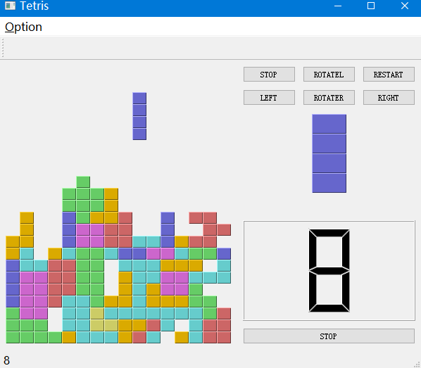

# PyQt5_examples
## Requirement:
PyQt5
## Example:
### 1: Tetris game
#### Altered version of http://zetcode.com/gui/pyqt5/tetris/
#### Changes:
- add menubar
- add nextPiece frame
- add lcd(show score)
- add control button
#### Show

